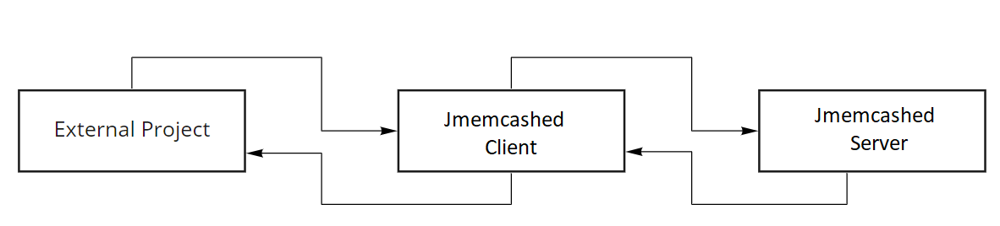

# jmemcashed-copy

## Description

This project is a simplified version of the data caching tool - memcached

### 1. Component interaction scheme:

### 2. Jmemcached server architecture:
### 3. Protocol description
#### 3.1 Request package:
#### 3.2 Flags and package length: 
#### 3.3 Response package:

